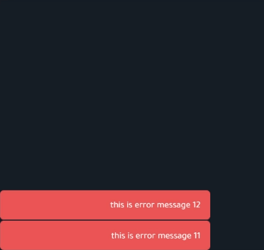

# show all the snackbars in a stack way (in a simple way)




## store file

```ts
interface SnackBar {
  id: number
  message: string
  color: string
  isShow: boolean
  position: number
}

export const useSnackbarStore = defineStore('snackbar', () => {
  const snackbars = ref<SnackBar[]>([])
  const ids = ref(0)

  const theSizeOfSnackbar = 50

  const show = (message: string, color: string) => {
    snackbars.value.push({
      id: ++ids.value,
      message,
      color,
      isShow: true,
      position: theSizeOfSnackbar * snackbars.value.length,
    })
  }

  const showError = (message: string) => show(message, 'error')

  const remove = (id: number) => {
    const removedIdx = snackbars.value.findIndex(x => x.id === id)

    snackbars.value.splice(removedIdx, 1)
    snackbars.value.forEach((x, idx) => (x.position = theSizeOfSnackbar * idx))
  }

  return { snackbars, remove, showError }
})
```

## vue file

```ts
<script setup lang="ts">
import { useSnackbarStore } from './useSnackbarStore'

const store = useSnackbarStore()

const { snackbars } = storeToRefs(store)

const onChanged = (id: number, isShow: boolean) => !isShow && store.remove(id)
</script>

<template>
  <VSnackbar
    v-for="(snackbar) in snackbars"
    :key="snackbar.id"
    v-model="snackbar.isShow"
    location="bottom end"
    variant="flat"
    :color="snackbar.color"
    :style="{ bottom: `${snackbar.position}px` }"
    @update:model-value="onChanged(snackbar.id, $event)"
  >
    {{ snackbar.message + snackbar.id }}
  </VSnackbar>
</template>

```
